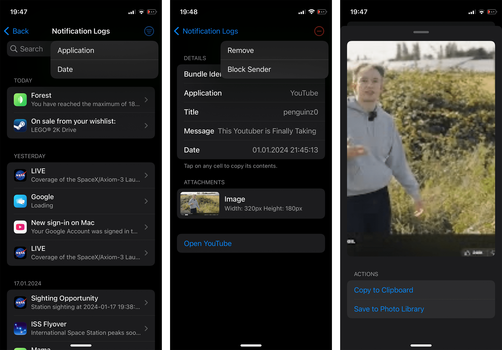

# Vē
Natively integrated notification logger.

## Preview

## Installation
1. Download the latest `deb` from the [releases](https://github.com/AlexandraAurora/Ve/releases)
2. Install the `deb` using your preferred method

## Compatibility
iPhone, iPad and iPod touch running iOS/iPadOS 14 or later.

## Compiling
  - [Theos](https://theos.dev/) is required to compile the project
  - Edit the root `Makefile` to use your Theos SDK

## License
[GPL-3.0](https://github.com/AlexandraAurora/Ve/blob/main/COPYING)
